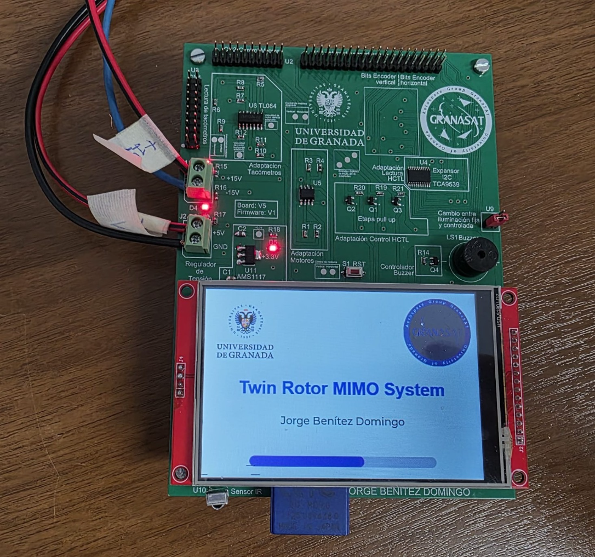
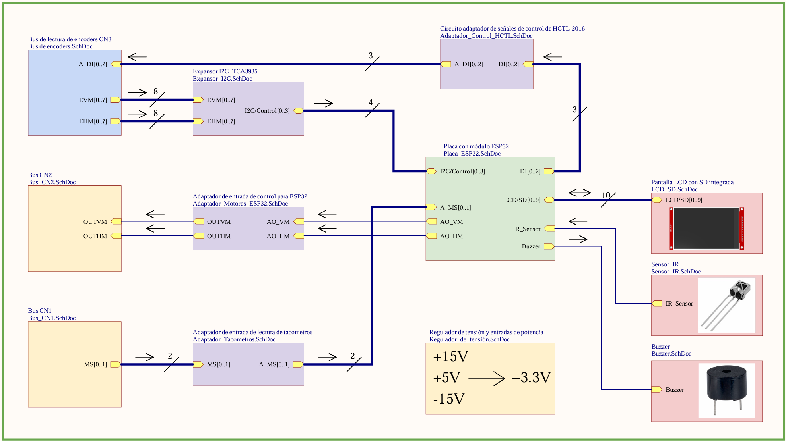
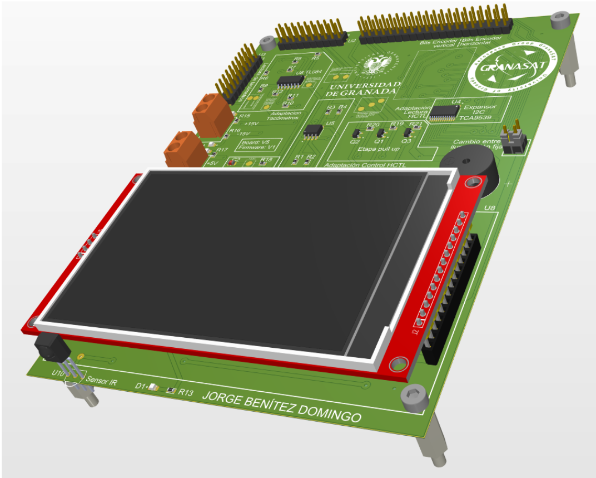

# Twin Rotor MIMO System (TRMS) - ESP32 Control Platform

Modern ESP32-based control platform for a Twin Rotor MIMO System (TRMS), developed as part of a Master's Thesis in Industrial Electronics at the University of Granada.



## Overview

This project replaces the original control system of a Twin Rotor MIMO System (TRMS), based on a PCL-812PG acquisition card, Windows XP and MATLAB, with a standalone embedded solution based on ESP32 and a touchscreen graphical interface.

The TRMS is an educational platform that emulates the dynamics of a helicopter using two orthogonal propellers, providing two degrees of freedom (2-DOF) and an angular range of ±180° on both axes. The system is intended for the study of multivariable control systems, including PID and future advanced control strategies such as LQR. :contentReference[oaicite:0]{index=0}

---

## Main Features

### Hardware

- Custom PCB designed in Altium Designer
- ESP32-WROOM-32 microcontroller
- 4" 480x320 TFT touchscreen display
- SD card support
- Infrared remote control support
- Dual encoder acquisition system
- Tachometer feedback acquisition
- Analog motor control interface
- On-board buzzer
- Status LEDs
- Dedicated voltage regulation stage

### Software

- Touchscreen graphical user interface (LVGL)
- Manual control mode
- Closed-loop PID control mode
- Real-time encoder monitoring
- Real-time motor speed monitoring
- Configuration storage in non-volatile memory
- SD card configuration management
- Infrared remote navigation
- Screensaver system
- Interactive diagrams and educational visualizations
- Boot animation and startup diagnostics

---

## System Architecture

```text
                +-------------------+
                |      ESP32        |
                +---------+---------+
                          |
      +-------------------+-------------------+
      |                   |                   |
      |                   |                   |
 Encoders            Tachometers         Motor Drivers
      |                   |                   |
      +---------+---------+---------+---------+
                          |
                    PID Controller
                          |
                   Touchscreen GUI
                          |
                      User Input
```
## Complete Block Diagram


---

## PCB Design

The project includes a custom PCB developed specifically for interfacing the ESP32 with the original TRMS hardware.

### 3D Model



### Manufactured PCB


The board integrates:

- Encoder interface circuitry
- Tachometer conditioning stage
- Motor control adaptation circuits
- I²C I/O expansion (TCA9539)
- Infrared receiver
- Buzzer controller
- Power regulation circuitry
- Touchscreen display interface

---

## Firmware Architecture

The firmware was developed in a modular way to simplify maintenance and future expansion.

### Main Libraries

| Library | Function |
|----------|----------|
| DisplayTouch | Display, touch controller and LVGL integration |
| Encoders | HCTL encoder acquisition |
| Tacho | Tachometer acquisition and RPM calculation |
| MotorControl | Motor command generation |
| PID_Control | Closed-loop control implementation |
| PID_Parameters | PID parameter management |
| Ang_Select | Reference angle selection |
| Navigation | GUI navigation |
| IRControl | Infrared remote control support |
| SD_Control | SD card management |
| General_Diagram | Interactive system diagrams |
| Remote_Diagram | IR configuration interface |
| ScreensaverState | Screensaver management |
| Boot_Animation | Startup animation |
| Load_Screen | Startup loading screen |
| SerialAnsiLogger | Real-time serial monitoring |

---

## Graphical User Interface

The controller includes a complete touchscreen interface developed with LVGL.

### Available Screens

- Startup screen
- Manual control mode
- PID control mode
- Encoder monitoring
- PID tuning
- System diagrams
- Remote control configuration
- Encoder calibration
- Screensaver mode

---

## Control System

The current implementation focuses on PID control.

### Available Modes

- Manual operation
- Position control
- Full MIMO PID control

### PID Features

- Independent horizontal and vertical control loops
- Real-time tuning
- Persistent parameter storage
- Graphical response visualization
- Reference tracking
- Disturbance rejection testing

The software architecture has been designed to allow future integration of more advanced controllers such as:

- LQR
- State-space controllers
- Adaptive control
- Model Predictive Control (MPC)

---

## Hardware Interfaces

### Encoder Acquisition

The system reads both TRMS encoders using:

- HCTL-2016 decoder ICs
- TCA9539 I²C expander
- Dedicated adaptation circuitry

### Motor Control

Motor commands are generated using:

- ESP32 DAC outputs
- Signal adaptation circuitry
- Original TRMS power stages

### Tachometer Monitoring

Rotor speed feedback is obtained through:

- Analog tachometers
- Signal conditioning stages
- ESP32 ADC acquisition

---

## Repository Structure

```text
.
├── src/
│   └── main.cpp
│
├── Custom_Libraries/
│   ├── DisplayTouch
│   ├── Encoders
│   ├── Tacho
│   ├── MotorControl
│   ├── PID_Control
│   ├── PID_Parameters
│   ├── Ang_Select
│   ├── IRControl
│   ├── Navigation
│   ├── SD_Control
│   ├── General_Diagram
│   ├── Remote_Diagram
│   ├── ScreensaverState
│   ├── Boot_Animation
│   └── ...
│
├── PCB/
├── Documentation/
└── README.md
```

---

## Development Environment

### Hardware

- ESP32-WROOM-32
- 4" SPI TFT Display
- Twin Rotor MIMO System (TRMS)

### Software

- PlatformIO / Arduino Framework
- LVGL
- TFT_eSPI
- Wire
- SPI
- SD

---

## Author

**Jorge Benítez Domingo**

Master's Degree in Industrial Electronics  
University of Granada

---

## Acknowledgements

Department of Electronics and Computer Technology  
University of Granada

GRANASAT Aerospace Group

---

## License

This project is published for academic and educational purposes.
